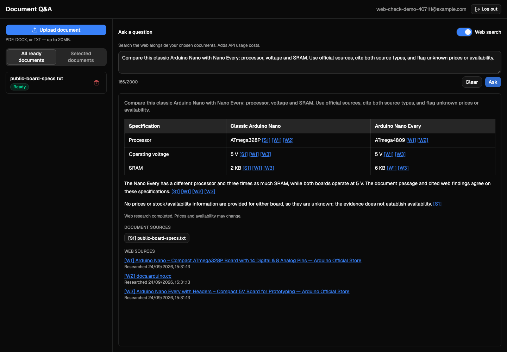

# RAG Document Q&A

A full-stack Retrieval-Augmented Generation app: register, upload PDF/DOCX/TXT documents, and ask questions that are answered from your own uploaded content by default — with streamed answers and citations back to the exact source passage. Enable **Web search** to combine documents with current web findings, or research without documents.

**Features:** email/password authentication with JWT sessions · document upload with status tracking (`queued` → `processing` → `ready`/`failed`) · owner-scoped retrieval (your documents are never visible to anyone else) · streamed, cited answers over Server-Sent Events · an explicit "I don't know" response when a question isn't covered by your documents, instead of a fabricated one · a React workspace with a document sidebar, live streaming Q&A, and a citation detail panel.

**Stack:** Python, FastAPI, PostgreSQL + pgvector, SQLAlchemy, Alembic, Celery, Redis, OpenAI, React, TypeScript, Vite, Tailwind CSS, shadcn/ui, Docker Compose.

See [`docs/ARCHITECTURE.md`](docs/ARCHITECTURE.md) for how the pieces fit together, [`docs/API_REFERENCE.md`](docs/API_REFERENCE.md) for every endpoint, [`docs/DEMO.md`](docs/DEMO.md) for a verified screenshot walkthrough, and [`docs/EVALUATION.md`](docs/EVALUATION.md) for real Q&A results and known limitations. `plan/` has the part-by-part build history.

## Optional web research

The Web search toggle starts off. When enabled, the app performs a real, bounded search using the existing OpenAI key, then streams an answer with separate document and web sources. Comparison tables support horizontal scrolling on small screens. Stop cancels research or generation; Retry preserves the originally submitted mode. Selected-document mode still requires a selection.

Web research adds API charges. Defaults: `WEB_SEARCH_MODEL=gpt-5.6-luna`, up to three web-tool calls, 90 seconds for research, and 60 seconds for answer generation. No database migration or background research worker is needed. See [API details and limits](docs/API_REFERENCE.md#optional-web-research).

[](docs/DEMO.md#web-comparison-demonstration)

*Real comparison using a disposable public sample. See the [web-search walkthrough](docs/DEMO.md#web-comparison-demonstration) for mobile and source-list screenshots.*

## Prerequisites

- Docker and Docker Compose
- A web browser
- An OpenAI API key **with credit on it** — without one, uploads still queue and process but every document ends in `status: "failed"`, and every question returns a provider error

## Setup

1. **Configure the environment:**
   ```bash
   cp .env.example .env
   ```
   Edit `.env` and set `OPENAI_API_KEY` to your key. Everything else has a working default (see `.env.example`).

2. **Start the stack:**
   ```bash
   docker compose up --build
   ```
   This starts five services: `db` (Postgres + pgvector, host port `5433`), `redis` (host port `6380`), `api` (FastAPI, host port `8010`), `worker` (Celery), and `frontend` (Vite dev server, host port `5173`). Host ports are non-default to avoid clashing with other local services; containers still talk to each other over the internal Docker network using the default ports.

3. **Run migrations** (in a separate terminal, once `db` is healthy):
   ```bash
   docker compose run --rm api alembic upgrade head
   ```
   This enables the `pgvector` extension and creates the `users`, `documents`, and `chunks` tables.

4. **Check everything is healthy:**
   ```bash
   curl http://localhost:8010/health     # -> {"status":"ok"}
   curl http://localhost:5173/api/health # -> {"status":"ok"}, confirms the frontend's proxy reaches the API
   ```

5. **Open the app:**
   - Frontend: **http://localhost:5173**
   - Interactive API docs (Swagger UI): **http://localhost:8010/docs**

   Register an account, upload a document, and ask a question. See [`docs/DEMO.md`](docs/DEMO.md) for a full walkthrough with screenshots using the included sample documents in [`samples/`](samples/).

## Persistent storage and restarts

- **Database**: `pgdata` is a named Docker volume — survives `docker compose down` (only removed with `docker compose down -v`).
- **Uploaded files**: stored in `./uploads/` in the project root, a real gitignored directory (not a Docker volume) — inspect or delete it directly from the host.
- **`.env` changes require a container recreate, not just a restart.** `env_file: .env` is only read when a container is *created* — editing `.env` and running `docker compose restart` will **not** pick up the change. Run:
  ```bash
  docker compose up -d --force-recreate api worker
  ```

## Stopping the stack

```bash
docker compose down
```
Add `-v` to also remove the `pgdata` volume and start clean.

## Local development vs. production

The commands above use the **development** Compose file: source mounts, Uvicorn reload, and Vite's dev server.

For the Oracle server, use the separate [production deployment guide](docs/DEPLOYMENT.md). It builds static React assets served by Caddy, runs non-root application containers, keeps database/Redis/API ports private, and persists data in named volumes. The base configuration binds to `127.0.0.1:8080` for SSH access. The [public HTTPS guide](docs/PUBLIC_DEPLOYMENT.md) adds automatic TLS and registration approved by the owner. Production secrets live in an ignored `.env.production` file; `.env.production.example` contains placeholders only.

Public deployment requires a hostname pointing to the server and inbound TCP ports 80/443. Visitors request access; the owner receives an email and approves requests on a private page. Approved visitors receive a single-use link to choose their own password. OpenAI usage remains separately billed, and invite-only access does not impose a spending cap.

## Development commands

```bash
docker compose exec api pytest -v                                    # backend tests
docker compose exec frontend sh -c "npm run lint && npm run typecheck && npm test && npm run build"  # frontend checks
docker compose exec db psql -U rag -d rag -c "\dx vector"             # confirm pgvector enabled
docker compose exec worker celery -A app.celery_app inspect ping     # confirm worker <-> redis
```

Frontend can also run standalone, outside Docker, against the same backend — see [`frontend/README.md`](frontend/README.md).
