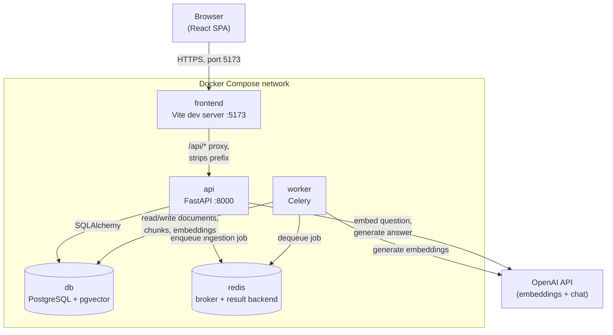
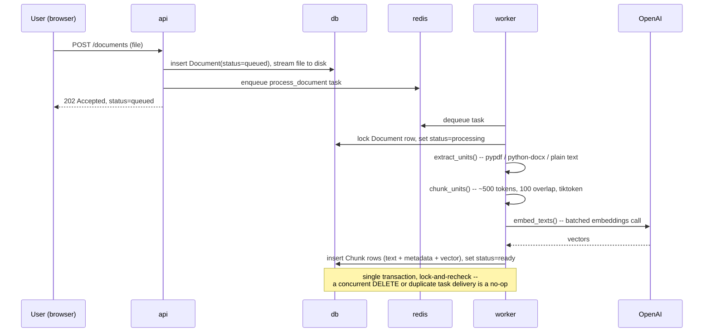
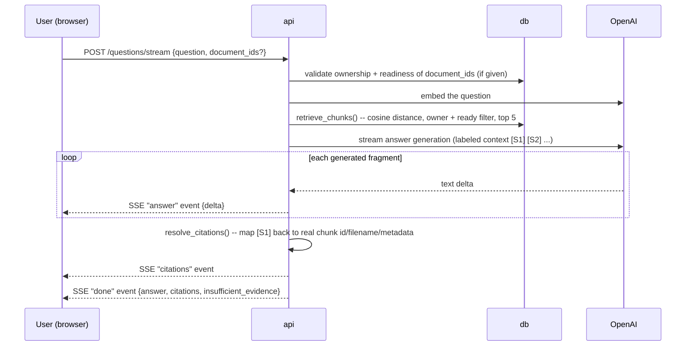

# Architecture

## Components

The browser never talks to the `api` container directly, never sees its port, and never holds an API key — every request from the SPA goes through the Vite dev server's `/api` proxy, which forwards to FastAPI and strips the prefix (`vite.config.ts`). This is a development convenience (real cross-origin/CORS setup and a production build are out of scope here — see [README.md's Production note](../README.md#local-development-vs-production)).

## Two independent flows

### 1. Ingestion (upload → searchable)

**Ownership filtering**: every document/chunk row carries an owner. `app/documents/queries.py`'s `get_owned_document`/`get_owned_chunks` scope every lookup by the authenticated user's id and return `404` (never `403`) when a document is missing *or* owned by someone else — a caller can't distinguish "doesn't exist" from "not yours."

**Chunking and metadata**: PDF units are per-page, DOCX units are per-paragraph plus per-table-row, TXT units are per-line (`app/ingestion/extraction.py`). `chunk_units` (`app/ingestion/chunking.py`) token-encodes all units with `tiktoken`, slides a 500-token window with 100-token overlap over the flattened sequence, and preserves each chunk's originating page/line/paragraph/table reference as `source_metadata` — this is what the frontend's citation panel displays (converting DOCX's 0-based paragraph/table indices to 1-based for humans; see `frontend/src/lib/citations.ts`).

**Embeddings**: `embed_texts` (`app/ingestion/embeddings.py`) calls OpenAI in batches and validates each vector's dimension. Transient failures (rate limits, timeouts) retry up to 3 times with exponential backoff before the document is marked `failed` with a safe error message — the caller never sees a raw provider error.

### 2. Question answering (ask → grounded, cited answer)

**Retrieval** (`app/retrieval/queries.py`): filters by owner + `status=ready` + non-null embedding *before* ranking (a SQL `WHERE`, not post-filtering), then orders by `Chunk.embedding.cosine_distance(query_embedding)` — exact/brute-force search, no vector index, since this is a portfolio-scale dataset (see [Limitations](EVALUATION.md#limitations)).

**Prompt-injection resistance**: the system prompt explicitly tells the model every retrieved passage is untrusted data, not instructions (`app/retrieval/generation.py`) — verified during Part 4 development against a real prompt-injection attempt embedded in a test document.

**Citation validation**: the model may only refer to passages by label (`[S1]`, `[S2]`, ...). `resolve_citations` (`app/retrieval/citations.py`) maps each label back to the *actual* retrieved chunk — the model's own claims about filenames or page numbers are never trusted directly, only its choice of *which* labeled passage it used. `pipeline.py`'s `finalize_answer` further enforces that a substantive answer needs ≥1 citation and an insufficient-evidence answer needs exactly 0, in both directions.

**Provisional vs. authoritative**: streaming `answer` events carry incremental text fragments meant for progressive display only. The frontend (`useQuestionStream.ts`) treats this text as provisional and discards it on any `error` or dropped connection — only the terminal `done` event's `answer` field is authoritative and gets persisted to the UI's final state. This distinction exists because a stream can fail *after* useful-looking partial text has already rendered; showing that partial text as if it were the final answer would be misleading.

**Insufficient evidence**: an unrelated question, or one with no `ready` documents at all, returns `insufficient_evidence: true` with no citations rather than a fabricated answer — verified with real questions in [EVALUATION.md](EVALUATION.md).

## Further reading

- [API_REFERENCE.md](API_REFERENCE.md) — every endpoint, request/response shape, and error code
- [DEMO.md](DEMO.md) — a verified end-to-end browser walkthrough with screenshots
- [EVALUATION.md](EVALUATION.md) — 15 real questions run against real sample documents, plus known limitations
