# Demo Walkthrough

The original document-only walkthrough uses the fictional sample documents in [`samples/`](../samples/) — a fake smart-home hub's product guide, support policy, and troubleshooting guide. The web-search walkthrough below uses public Arduino specifications and a disposable demo account. No private documents or credentials appear in the screenshots.

**Original walkthrough verified (Web search off).** Steps 1–7 below were run against the real, running Docker stack — real registration, real uploads, real OpenAI calls, real streaming — using an automated browser (Playwright) driving the actual app at `http://localhost:5173`, on 2026-09-22. The original screenshots are real captures from that run. The web-search screenshots were captured separately on 2026-09-24.

## Prerequisites

- The stack running via `docker compose up --build` (see [README.md](../README.md))
- A funded `OPENAI_API_KEY` in `.env`

## Steps

### 1. Register and log in

Open `http://localhost:5173`, register a new account, then log in.

| Register | Log in |
|---|---|
| 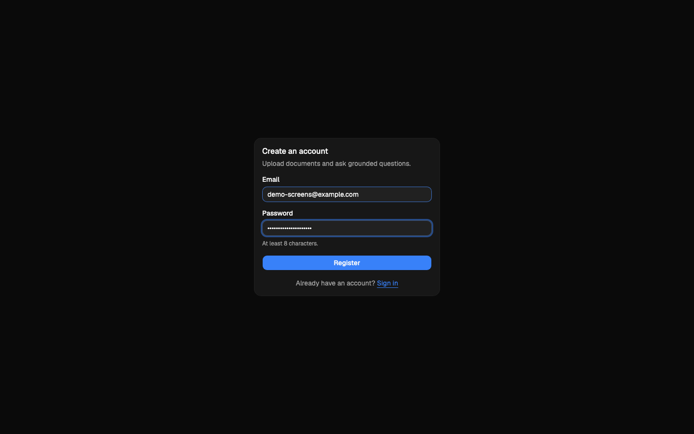 | 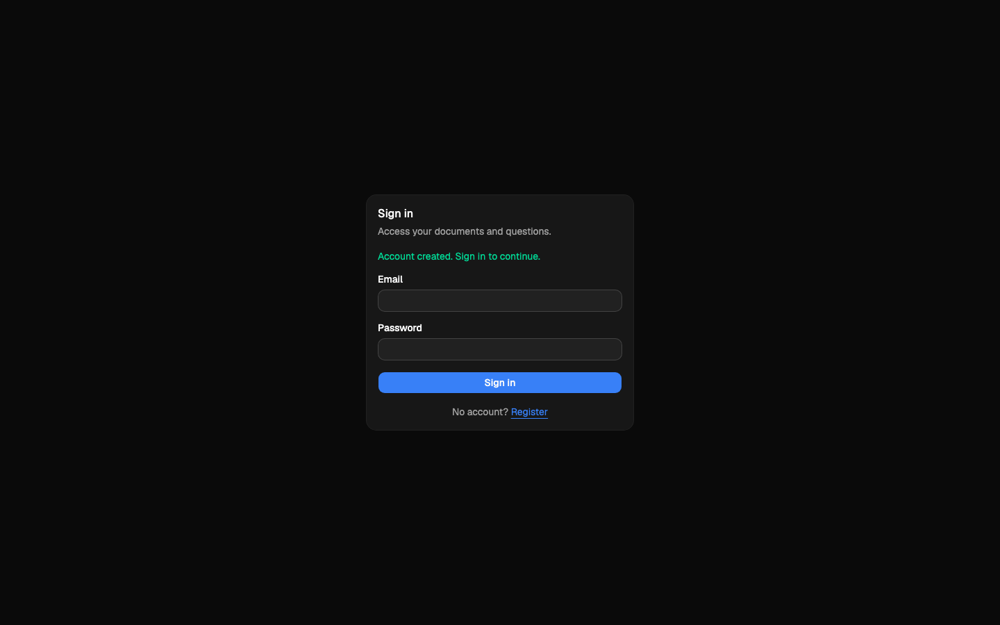 |

### 2. Upload the samples and wait for processing

Upload all three files from `samples/`: `product_guide.pdf`, `support_policy.docx`, `troubleshooting_guide.txt`. Each shows `queued` → `processing` → `ready` (polled automatically every 2 seconds).

| Empty workspace | Uploading | All ready |
|---|---|---|
| 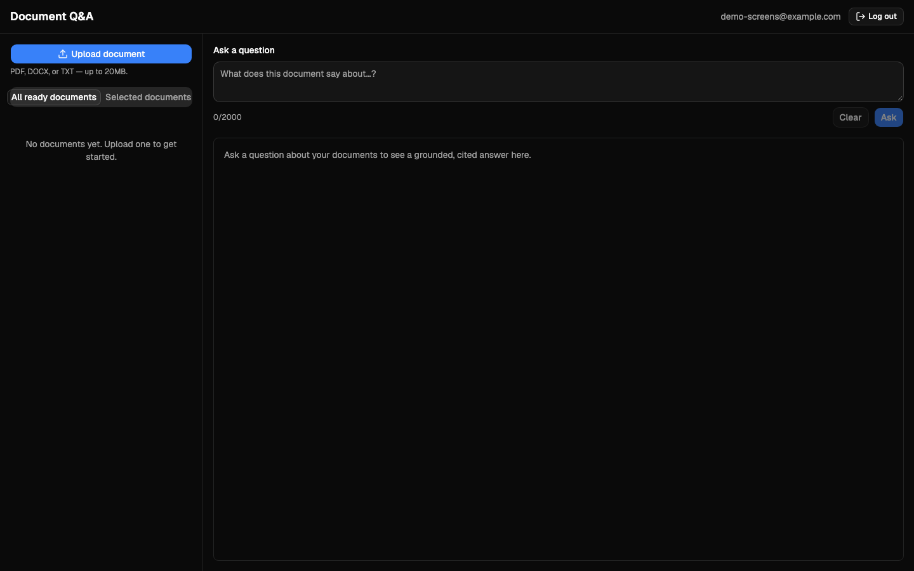 | 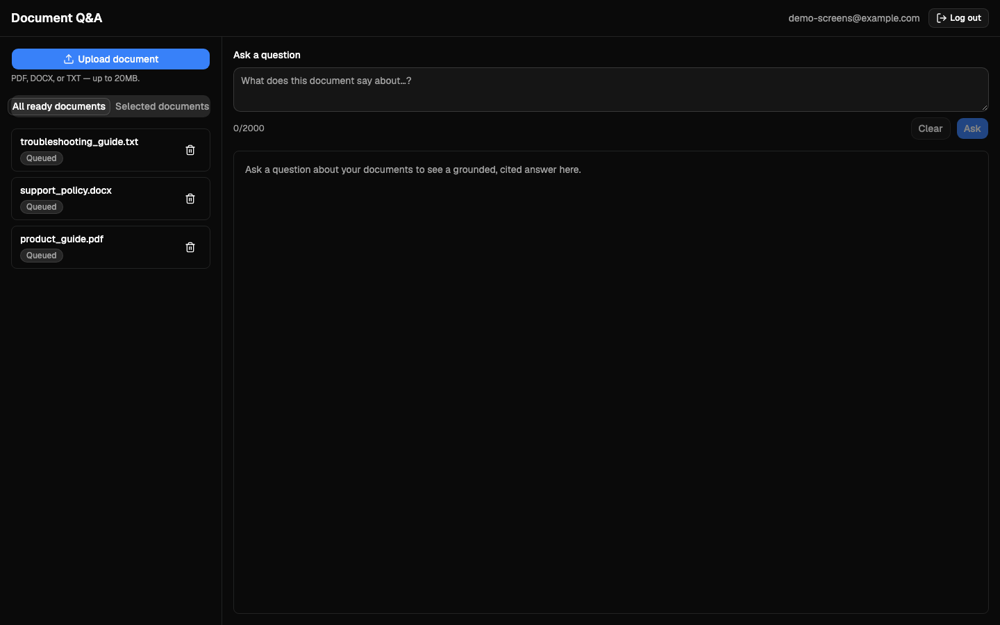 | 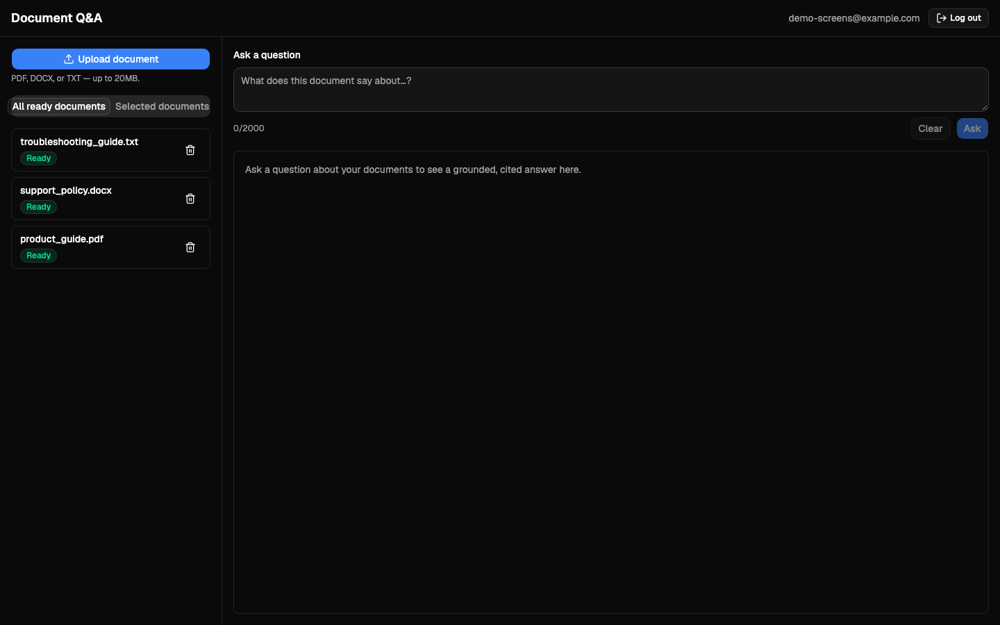 |

**Expected time:** a few seconds per document for text this short. **If a document gets stuck in `processing`** for more than a minute, check `docker compose logs worker` — most often this means `OPENAI_API_KEY` is missing or has no credit, in which case the document will instead land in `failed` with a specific error message rather than hanging.

### 3. Ask a supported question

With all three documents ready (in "All ready documents" mode — no selection needed), ask:

> What is the warranty period on the hub, and what does it exclude?

### 4. Observe streaming and inspect the cited passage

The answer appears progressively while generating, then the final answer appears with a `[S1] support_policy.docx` citation button. Click it to open the citation panel with the exact supporting passage.

| Streaming | Final answer + citation | Citation panel |
|---|---|---|
| 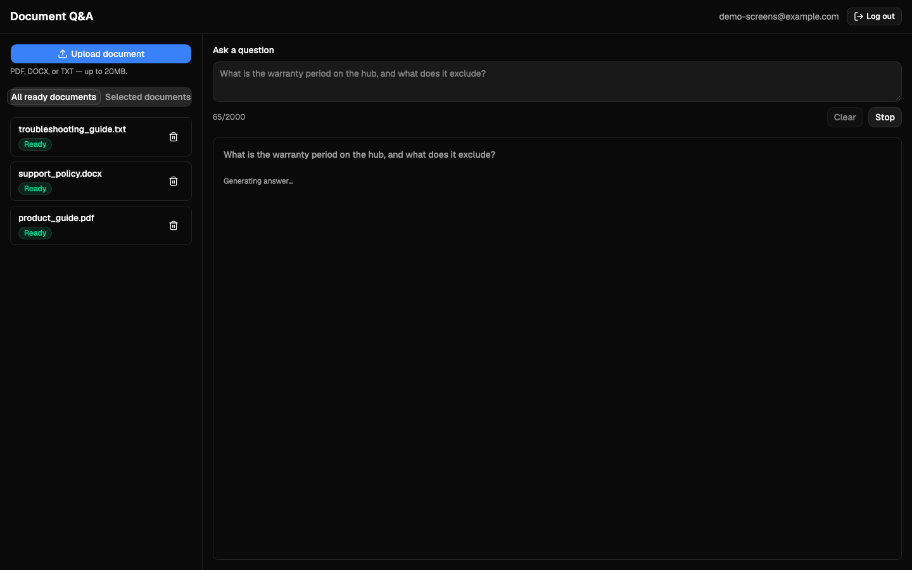 | 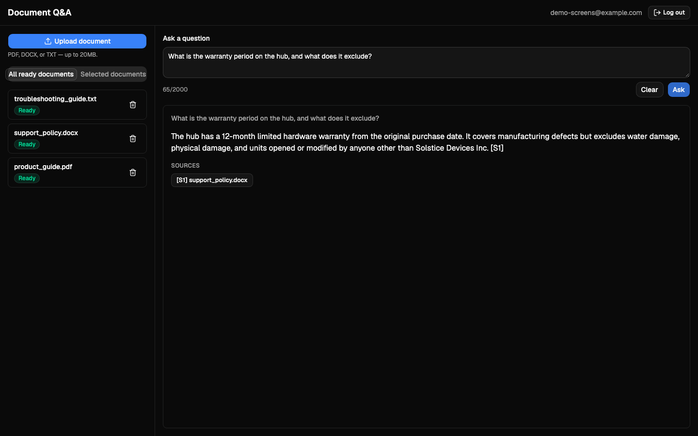 | 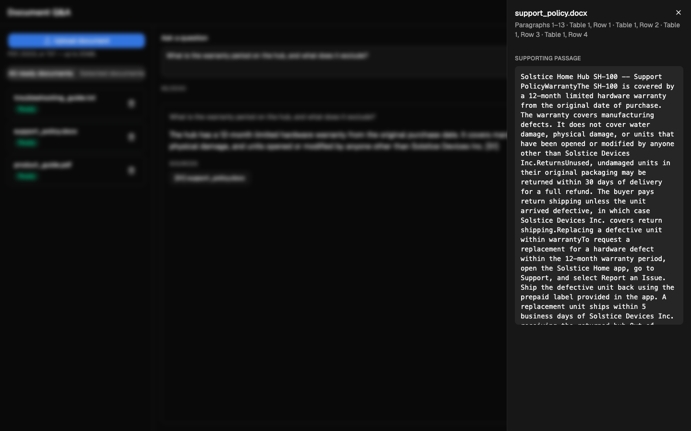 |

### 5. Ask an unsupported question

> What is the retail price of the Solstice Home Hub?

None of the three documents mention a price, so this correctly returns `insufficient_evidence: true` with no fabricated answer and no citations.

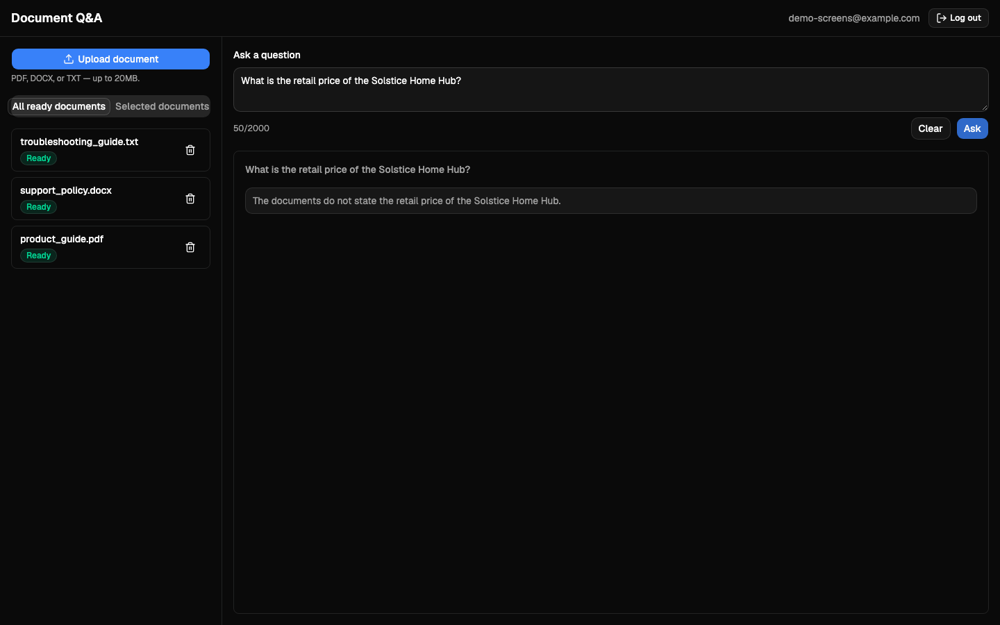

### 6. Verify isolation using a second user

Log out, register a second account, and ask the same question about the hub *without* uploading anything. Verified result: `insufficient_evidence: true`, and `GET /documents` for the second account returns an empty list — the first account's documents are never visible.

### 7. Delete the demo documents

Delete all three uploaded documents from the sidebar (confirmation dialog required for each). Verified result: the document list returns to empty, and `GET /documents` confirms `total: 0`.

## Mobile / responsive layout

At a 390px-wide viewport (iPhone-sized), the document sidebar collapses into a drawer opened via the hamburger icon in the header, and the Q&A area remains fully usable.

| Mobile workspace | Sidebar drawer | Mobile answer |
|---|---|---|
| 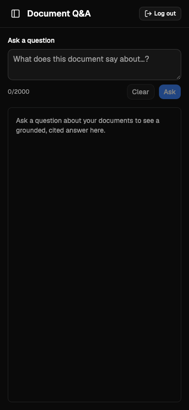 | 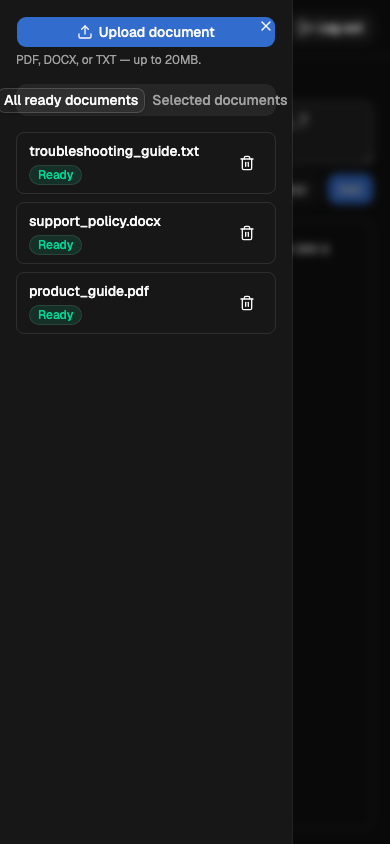 | 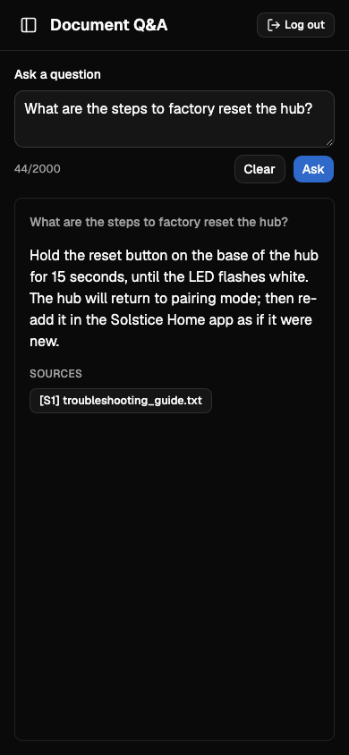 |

## Keyboard navigation

Verified with an automated keyboard-only pass (no mouse), confirming every item Part 6 had left unconfirmed:

- Tab order on the login form: email → password → submit, form submits on Enter
- Tab order in the Q&A panel: question textarea → Clear → Ask
- The Ask button activates via Enter/Space when focused (not just click)
- The citation button is reachable by Tab and opens the citation panel via Enter
- `Escape` closes the citation panel
- The focused element always has a visible focus indicator (outline or box-shadow)
- The answer region has `aria-live="polite"` for screen-reader announcements
- No duplicate/nested `role="alert"` elements (the bug found and fixed during Part 6)

## Troubleshooting reference

| Symptom | Likely cause | What to check |
|---|---|---|
| Upload stuck in `processing` | Missing/invalid/rate-limited `OPENAI_API_KEY` | `docker compose logs worker` |
| Document lands in `failed` | Corrupt, encrypted, empty, or scanned-with-no-text file | The document's `error_message` field |
| Streaming answer never completes, no `error` shown | Client network interruption without a clean disconnect | Retry — the frontend discards provisional text and offers a Retry button on any stream failure |
| `insufficient_evidence: true` unexpectedly | No `ready` documents in scope, or the question truly isn't covered | Confirm document status is `ready`, and that the right selection mode/documents are chosen |
| Frontend can't reach the API | `frontend` container's `VITE_API_PROXY_TARGET` misconfigured | `curl http://localhost:5173/api/health` should return `{"status":"ok"}` |

## Web comparison demonstration

1. Upload a disposable TXT containing: “Arduino Nano (classic) uses ATmega328P, operates at 5V, and has 2KB SRAM. No prices or stock availability are listed.” Wait for Ready.
2. Enable **Web search** and ask: “Compare this classic Arduino Nano with Nano Every: processor, voltage and SRAM. Use official sources, cite both source types, and flag unknown prices or availability.”
3. Observe **Searching the web…**, then **Generating answer…**. Confirm the table, inline document/web markers, document passage panel, and separately linked web sources with research timestamps.
4. On a phone, scroll the table horizontally within the answer panel. Use Stop during another request; Retry after a failure retains that request's original mode.
5. Delete the disposable document. With all-ready mode selected, web research also works with no documents. Turning Web search off returns to document-only answers.

**Screenshot run: 2026-09-24.** A disposable local account uploaded `public-board-specs.txt` through the API and waited for real ingestion to complete. The current browser interface then made a real streamed web-search request. The answer contained an S1 document citation and three Arduino web sources. All three images below show that same completed answer; no response content was mocked or edited. The account and document were removed after capture.

### Desktop comparison

*Desktop at 1440 × 1000: document and web evidence appear together in a comparison table. Missing price and availability information is stated explicitly.*

### Mobile comparison

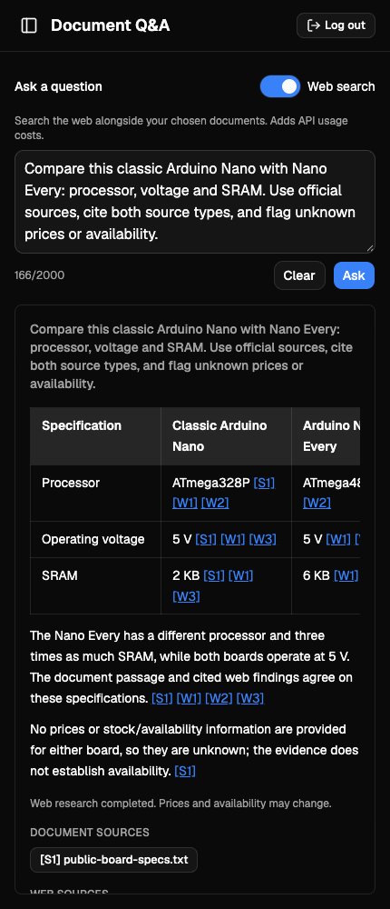

*Mobile at 430 × 1000: the table scrolls horizontally inside the answer panel to reveal the remaining columns; the page itself does not overflow.*

### Document and web sources

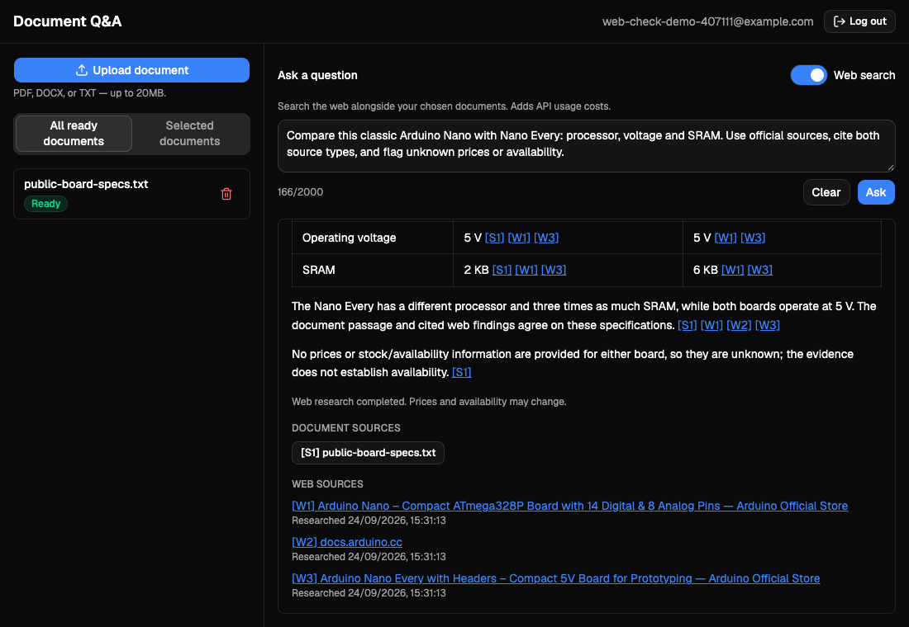

*Source-list view at 1100 × 760: S1 opens the supporting document passage; W1–W3 link to the web evidence. Timestamps identify when research ran.*

See [web-search verification results](EVALUATION.md#web-search-verification-2026-09-24) for observed results and the separate mocked-test coverage. Prices, wording, source ordering, and search results can change across runs.
